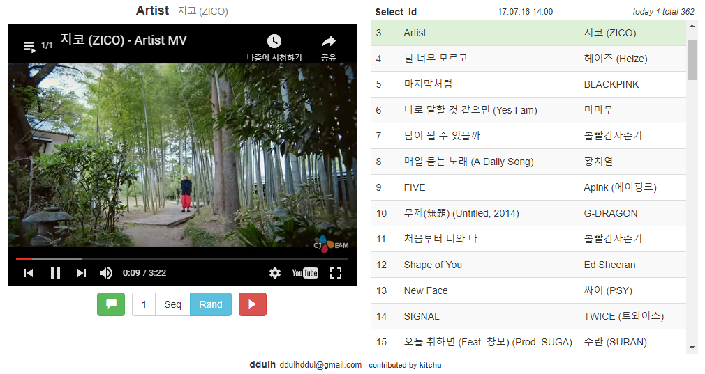

# [Music Top 100](http://mlchart.ml/song/)
URL : [http://mlchart.ml/song/](http://mlchart.ml/song/)

## 1. 개요
    
    최신 K-pop 순위를 실시간 반영하여
    
    Youtube 영상을 볼 수 있습니다.

    Mp3로 활용하여 언제 어디서나 음악을 즐기세요.

    list 는 1시간마다 update 됩니다.

    IE, CHROME, 안드로이드 모바일 브라우저를 지원합니다.
    (모바일에선 최초 재생을 한번 눌러야 작동합니다.)

## 2. 화면 Overview

## 3. 기능
- 한곡반복, 순차재생, 랜덤재생
- 실시간 채팅기능(Contributed by Kitchu)
- Select 버튼을 눌러 원하는 곡만 선택하여 즐기세요.
- Id 버튼을 눌러 리스트에 없는 유투브 영상도 한곡 반복으로 즐겨보세요 (Youtube Video Id 입력)

## 4. Tech
- [Node.js](https://nodejs.org/)
- [mongoDB](https://www.mongodb.com/)
- [jade(pug)](https://www.npmjs.com/package/jade)

## 5. Developer
뚫뚤 (ddulhddul@gmail.com)
> 의견, Request, Contribution 언제나 환영합니다.